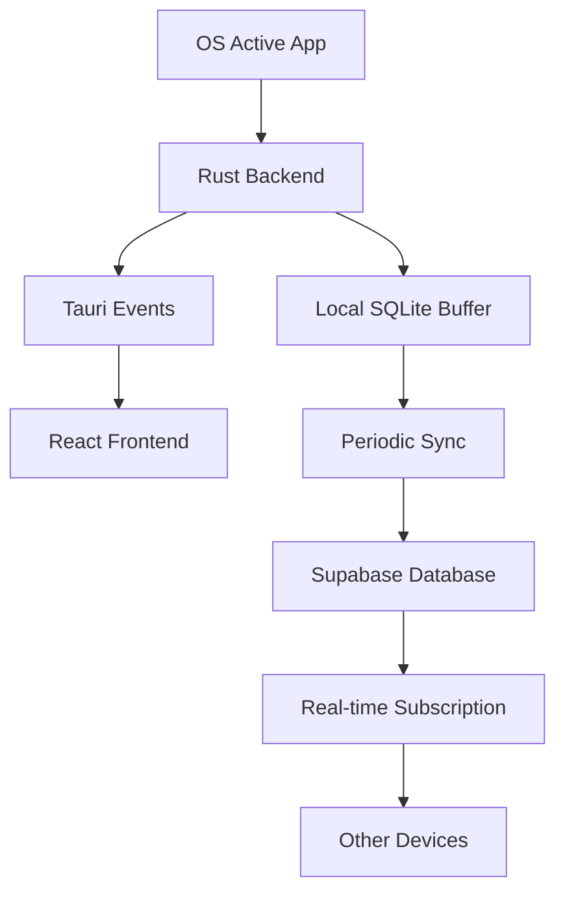

# 📄 Architecture Document: Loopd - Cross-Platform Productivity App

## 1. **Overview**

**Loopd** is a cross-platform desktop application that tracks application usage, provides productivity insights, and will support app blocking with cloud synchronization. Built with **Tauri (Rust backend)** and **Next.js (React frontend)**, using **SQLite** for local storage and **Supabase** for cloud sync and authentication.

---

## 2. **System Architecture**

### 2.1 High-Level Architecture

```
┌─────────────────┐    ┌─────────────────┐    ┌─────────────────┐
│   Frontend      │    │   Backend       │    │   Cloud         │
│   (Next.js)     │◄──►│   (Rust/Tauri)  │◄──►│   (Supabase)    │
│                 │    │                 │    │                 │
│ • Dashboard     │    │ • App Tracking  │    │ • Auth          │
│ • Real-time UI  │    │ • Local Storage │    │ • Cloud Sync    │
│ • User Controls │    │ • Event System  │    │ • Analytics     │
└─────────────────┘    └─────────────────┘    └─────────────────┘
```

### 2.2 Frontend (Next.js + React)

* **Tech Stack**: React 19, Next.js 15, TypeScript, Tailwind CSS, Lucide React
* **Responsibilities**:
  * Display real-time app usage dashboard
  * Show current active application
  * Provide data management controls
  * Handle user interactions and settings
  * Communicate with Rust backend via Tauri commands/events

* **Key Components**:
  * `src/app/page.tsx` - Main dashboard with usage display
  * `src/app/timeline/page.tsx` - Timeline view for chronological app usage history (no table view)
  * `src/lib/supabase.ts` - Supabase client configuration
  * Real-time event listeners for app switching

### 2.3 Backend (Tauri + Rust)

* **Tech Stack**: Rust, Tauri 2.0, SQLx, SQLite
* **Responsibilities**:
  * Monitor active applications using OS-specific APIs
  * Store usage data locally in SQLite
  * Emit real-time events to frontend
  * Manage device identification
  * Handle data persistence and retrieval

* **Key Modules**:
  * `src-tauri/src/usage.rs` - App tracking implementation
  * `src-tauri/src/database.rs` - Database operations
  * `src-tauri/src/lib.rs` - Main application logic and Tauri commands
  * `src-tauri/src/storage.rs` - Local storage management

### 2.4 Cloud Infrastructure (Supabase)

* **Tech Stack**: Supabase Auth, PostgreSQL, Real-time subscriptions
* **Responsibilities**:
  * User authentication and session management
  * Cloud data synchronization
  * Cross-device data sharing
  * Analytics and usage insights

---

## 3. **Data Flow Architecture**

### 3.1 App Usage Tracking Flow



### 3.2 Real-time Event System

```rust
// Backend emits events when app switches
window.emit("switched", app_info)?;

// Frontend listens for events
useEffect(() => {
  listen('switched', () => {
    fetchUsage();
    fetchCurrentApp();
  });
}, []);
```

---

## 4. **Database Architecture**

### 4.1 Local Storage (SQLite)

**Current Implementation**:
```sql
-- Sessions table for local usage tracking
CREATE TABLE sessions (
    id INTEGER PRIMARY KEY AUTOINCREMENT,
    device_id TEXT NOT NULL,
    app_name TEXT NOT NULL,
    window_title TEXT,
    start_time DATETIME NOT NULL,
    end_time DATETIME,
    duration_seconds INTEGER
);

-- Device identification
CREATE TABLE devices (
    id TEXT PRIMARY KEY,
    created_at DATETIME DEFAULT CURRENT_TIMESTAMP
);
```

### 4.2 Cloud Storage (Supabase/PostgreSQL)

**Planned Schema**:
```sql
-- App usage logs (synced from local)
app_usage_logs (
    id UUID DEFAULT gen_random_uuid() PRIMARY KEY,
    user_id UUID REFERENCES auth.users(id) ON DELETE CASCADE,
    app_name TEXT NOT NULL,
    window_title TEXT,
    duration_seconds INTEGER NOT NULL,
    start_time TIMESTAMP WITH TIME ZONE,
    device_id TEXT NOT NULL,
    created_at TIMESTAMP WITH TIME ZONE DEFAULT NOW()
);

-- Blocked apps (future feature)
blocked_apps (
    id UUID DEFAULT gen_random_uuid() PRIMARY KEY,
    user_id UUID REFERENCES auth.users(id) ON DELETE CASCADE,
    app_name TEXT NOT NULL,
    created_at TIMESTAMP WITH TIME ZONE DEFAULT NOW()
);

-- Emergency overrides (future feature)
overrides (
    id UUID DEFAULT gen_random_uuid() PRIMARY KEY,
    user_id UUID REFERENCES auth.users(id) ON DELETE CASCADE,
    app_name TEXT NOT NULL,
    expires_at TIMESTAMP WITH TIME ZONE,
    created_at TIMESTAMP WITH TIME ZONE DEFAULT NOW()
);
```

---

## 5. **Platform-Specific Implementation**

### 5.1 Windows Implementation

```rust
// Windows-specific app detection
#[cfg(windows)]
pub fn get_active_app_info() -> Result<AppInfo, Box<dyn std::error::Error>> {
    use windows::Win32::UI::WindowsAndMessaging::{GetForegroundWindow, GetWindowTextW};
    
    let hwnd = unsafe { GetForegroundWindow() };
    let mut title = [0u16; 512];
    let len = unsafe { GetWindowTextW(hwnd, &mut title) };
    
    // Extract process name and window title
    // ...
}
```

### 5.2 macOS Implementation

```rust
// macOS-specific app detection
#[cfg(target_os = "macos")]
pub fn get_active_app_info() -> Result<AppInfo, Box<dyn std::error::Error>> {
    use cocoa::appkit::NSWorkspace;
    use cocoa::base::id;
    
    let workspace: id = unsafe { NSWorkspace::sharedWorkspace(nil) };
    // Get active application info
    // ...
}
```

### 5.3 Linux Implementation

```rust
// Linux-specific app detection (X11)
#[cfg(target_os = "linux")]
pub fn get_active_app_info() -> Result<AppInfo, Box<dyn std::error::Error>> {
    use x11rb::connection::Connection;
    use x11rb::protocol::xproto::ConnectionExt;
    
    // Connect to X11 and get active window
    // ...
}
```

---

## 6. **Current Features vs. Planned Features**

### 6.1 ✅ Implemented Features

* **Real-time app tracking** across Windows, macOS, and Linux
* **Local SQLite storage** with session management
* **Live dashboard** showing current active app
* **Usage history** with daily breakdowns
* **Device identification** with persistent device IDs
* **Data management** (clear all data functionality)
* **Cross-platform compatibility**

### 6.2 🔄 In Development

* **Supabase integration** for cloud sync
* **User authentication** system
* **Real-time cross-device synchronization**

### 6.3 📋 Planned Features

* **App blocking** with overlay screens
* **Emergency override** functionality
* **Usage analytics** and productivity insights
* **Customizable tracking** intervals
* **Data export** capabilities

---

## 6. **Component Design Patterns**

Loopd's React components follow best practices for maintainability and scalability. Key guidelines:
- Use function components and hooks (no class components)
- Co-locate component, styles, and tests
- Use clear prop types and TypeScript interfaces
- Organize by feature when possible (see [React Handbook Project Standards](https://reacthandbook.dev/project-standards))
- Prefer composition over inheritance

Example structure:
```
src/components/
  ├── Button.tsx
  ├── TimelineView.tsx
  └── ...
```

---

## 🤝 Contributing

Contributions are welcome! Please fork the repo, create a branch, and open a pull request. For architectural changes, open an issue for discussion first.

---

_Last updated: 2025-07-03_
