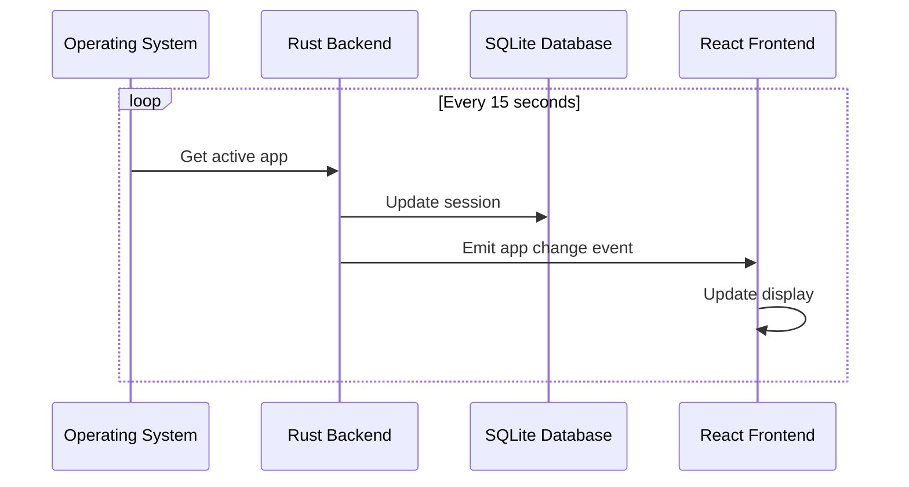
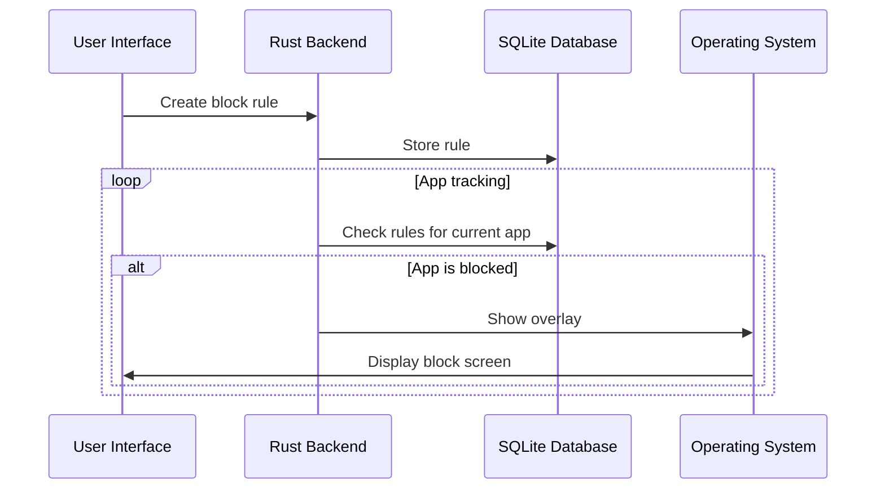
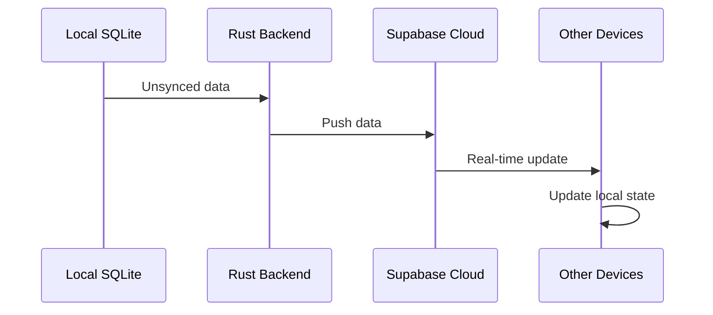

# 🏗️ Architectural Design Document - loopd Desktop App

## 1. **High-Level Architecture**

The system is architected around a **Tauri-based desktop client** that provides real-time app tracking, blocking capabilities, and local data management, with optional **Supabase backend** for cloud synchronization and authentication.

```mermaid
graph TD
    subgraph User's Desktop (Windows/macOS/Linux)
        A[Tauri Desktop App] --> B[Local SQLite Database]
        A --> C[App Tracking Engine]
        A --> D[Block Rules Engine]
        A --> E[UI Components]
        
        C --> F[OS APIs]
        D --> G[Overlay System]
        
        A --Optional Sync--> H[Supabase Backend]
        A --Auth--> I[Supabase Auth]
    end

    subgraph Supabase Cloud (Optional)
        H --> J[Postgres Database]
        H --> K[Real-time Subscriptions]
        I --> L[User Management]
    end

    subgraph Local Storage
        B --> M[Devices Table]
        B --> N[Sessions Table]
        B --> O[Block Rules Table]
        B --> P[Block Overrides Table]
    end

    style A fill:#D6EAF8,stroke:#333,stroke-width:2px
    style H fill:#D5F5E3,stroke:#333,stroke-width:2px
    style B fill:#FDEBD0,stroke:#333,stroke-width:2px
```

---

## 2. **Technology Stack**

### Frontend (Tauri WebView)
- **Framework**: Next.js 15 with React 19
- **Styling**: Tailwind CSS with shadcn/ui components
- **State Management**: React hooks and context
- **Build Tool**: Vite with TypeScript

### Backend (Tauri Rust)
- **Framework**: Tauri 2.x with Rust
- **Database**: SQLite with sqlx
- **OS Integration**: Platform-specific APIs for app tracking
- **Window Management**: Tauri window API for overlays

### Cloud Services (Optional)
- **Backend**: Supabase (PostgreSQL + Auth)
- **Real-time**: Supabase real-time subscriptions
- **Hosting**: Supabase hosting

---

## 3. **Database Schema (Local SQLite)**

### Core Tables

#### `devices` - Device Management
```sql
CREATE TABLE devices (
    id            TEXT PRIMARY KEY,      -- UUID generated on first run
    user_id       TEXT,                  -- Supabase uid (nullable until login)
    name          TEXT,                  -- e.g. "John's MacBook"
    os            TEXT,                  -- win32 / darwin / linux
    created_at    INTEGER NOT NULL,      -- unix epoch seconds (UTC)
    updated_at    INTEGER NOT NULL       -- unix epoch seconds (UTC)
);
```

#### `sessions` - App Usage Tracking
```sql
CREATE TABLE sessions (
    id              TEXT PRIMARY KEY,    -- UUID
    device_id       TEXT NOT NULL,
    user_id         TEXT,                -- redundant but handy for queries
    app_name        TEXT NOT NULL,
    window_title    TEXT,
    start_time      INTEGER NOT NULL,    -- unix epoch seconds (UTC)
    end_time        INTEGER,             -- NULL until session closes
    duration_sec    INTEGER,             -- cached for fast aggregates
    synced          INTEGER NOT NULL DEFAULT 0,  -- 0 = local only, 1 = pushed to cloud
    created_at      INTEGER NOT NULL,    -- unix epoch seconds (UTC)
    FOREIGN KEY (device_id) REFERENCES devices(id)
);
```

#### `block_rules` - App Blocking Rules
```sql
CREATE TABLE block_rules (
    id              TEXT PRIMARY KEY,    -- UUID
    device_id       TEXT NOT NULL,
    user_id         TEXT,                -- redundant but handy for queries
    app_name        TEXT NOT NULL,       -- app to block
    block_type      TEXT NOT NULL,       -- 'time' or 'usage'
    time_window_start TEXT,              -- HH:MM format for time-based rules
    time_window_end TEXT,                -- HH:MM format for time-based rules
    daily_limit_minutes INTEGER,         -- minutes for usage-based rules
    strictness      TEXT NOT NULL,       -- 'hard' or 'soft'
    enabled         INTEGER NOT NULL DEFAULT 1,  -- 0 = disabled, 1 = enabled
    synced          INTEGER NOT NULL DEFAULT 0,  -- 0 = local only, 1 = pushed to cloud
    created_at      INTEGER NOT NULL,    -- unix epoch seconds (UTC)
    updated_at      INTEGER NOT NULL,    -- unix epoch seconds (UTC)
    FOREIGN KEY (device_id) REFERENCES devices(id)
);
```

#### `block_overrides` - Override Tracking
```sql
CREATE TABLE block_overrides (
    id              TEXT PRIMARY KEY,    -- UUID
    device_id       TEXT NOT NULL,
    user_id         TEXT,
    rule_id         TEXT NOT NULL,       -- reference to block_rules.id
    app_name        TEXT NOT NULL,       -- app that was blocked
    override_time   INTEGER NOT NULL,    -- unix epoch seconds (UTC)
    override_reason TEXT,                -- user-provided reason for override
    created_at      INTEGER NOT NULL,    -- unix epoch seconds (UTC)
    FOREIGN KEY (device_id) REFERENCES devices(id),
    FOREIGN KEY (rule_id) REFERENCES block_rules(id)
);
```

### Views for Analytics
```sql
-- Daily usage summary
CREATE VIEW usage_summary AS
SELECT
    date(start_time, 'unixepoch') AS day,
    app_name,
    SUM(duration_sec) AS total_seconds
FROM sessions
WHERE duration_sec IS NOT NULL
GROUP BY day, app_name
ORDER BY day DESC, total_seconds DESC;

-- Current session (for real-time tracking)
CREATE VIEW current_session AS
SELECT
    s.*,
    d.name as device_name,
    d.os as device_os
FROM sessions s
JOIN devices d ON s.device_id = d.id
WHERE s.end_time IS NULL
ORDER BY s.start_time DESC
LIMIT 1;
```

---

## 4. **Core Components**

### 4.1 App Tracking Engine (`usage.rs`)
- **Platform Detection**: OS-specific APIs for active app monitoring
- **Session Management**: Start/stop tracking with timing data
- **Real-time Updates**: Event emission for UI updates
- **Background Operation**: Continuous monitoring without UI blocking

### 4.2 Block Rules Engine (`blocking.rs`)
- **Rule Evaluation**: Check current app against blocking rules
- **Time-based Rules**: Window-based blocking (e.g., 9am-5pm)
- **Usage-based Rules**: Daily limit enforcement
- **Override Management**: Handle user override requests

### 4.3 Database Layer (`database.rs`)
- **Connection Management**: SQLite pool with migrations
- **Data Operations**: CRUD operations for all tables
- **Sync Management**: Track sync status for cloud operations
- **Query Optimization**: Efficient queries with proper indexing

### 4.4 UI Components
- **Dashboard**: Real-time usage display and statistics
- **Timeline View**: Detailed session history and filtering
- **Block Rules Manager**: Create, edit, and manage blocking rules
- **Block Screen**: Overlay interface for blocked applications
- **Authentication**: Supabase Auth integration

---

## 5. **API Specification (Tauri Commands)**

### App Tracking Commands
```rust
// Get current active application
get_active_app() -> Result<String, String>

// Get active app with window title
get_active_app_with_title() -> Result<AppInfo, String>

// Check accessibility permissions
check_accessibility_permissions_command() -> Result<bool, String>
```

### Database Commands
```rust
// Usage data queries
get_usage_summary_command() -> Result<UsageSummary, String>
get_usage_summary_for_period_command(start: i64, end: i64) -> Result<Vec<UsageSummary>, String>
get_current_session_command() -> Result<Option<Session>, String>
get_sessions_command() -> Result<Vec<Session>, String>

// Data management
clear_all_data_command() -> Result<(), String>
clear_all_data_and_reset_command() -> Result<(), String>

// Sync operations
sync_data_command() -> Result<(), String>
get_unsynced_sessions_command() -> Result<Vec<Session>, String>
test_supabase_connection_command() -> Result<bool, String>
```

### Blocking Commands
```rust
// Block rule management
create_block_rule_command(rule: BlockRule) -> Result<String, String>
get_block_rules_command() -> Result<Vec<BlockRule>, String>
update_block_rule_command(id: String, rule: BlockRule) -> Result<(), String>
delete_block_rule_command(id: String) -> Result<(), String>

// Block evaluation and overrides
evaluate_block_status_command(app_name: String) -> Result<BlockStatus, String>
record_block_override_command(rule_id: String, reason: String) -> Result<(), String>
get_block_overrides_command() -> Result<Vec<BlockOverride>, String>
```

---

## 6. **Data Flow Architecture**

### 6.1 Real-time App Tracking


### 6.2 Block Rule Evaluation


### 6.3 Cloud Synchronization


---

## 6. **Component Design Patterns**

Loopd's React components follow best practices for maintainability and scalability. Key guidelines:
- Use function components and hooks (no class components)
- Co-locate component, styles, and tests
- Use clear prop types and TypeScript interfaces
- Organize by feature when possible (see [React Handbook Project Standards](https://reacthandbook.dev/project-standards))
- Prefer composition over inheritance

Example structure:
```
src/components/
  ├── Button.tsx
  ├── TimelineView.tsx
  └── ...
```

---

## 🤝 Contributing

Contributions are welcome! Please fork the repo, create a branch, and open a pull request. For architectural changes, open an issue for discussion first.

---

_Last updated: 2025-07-03_
