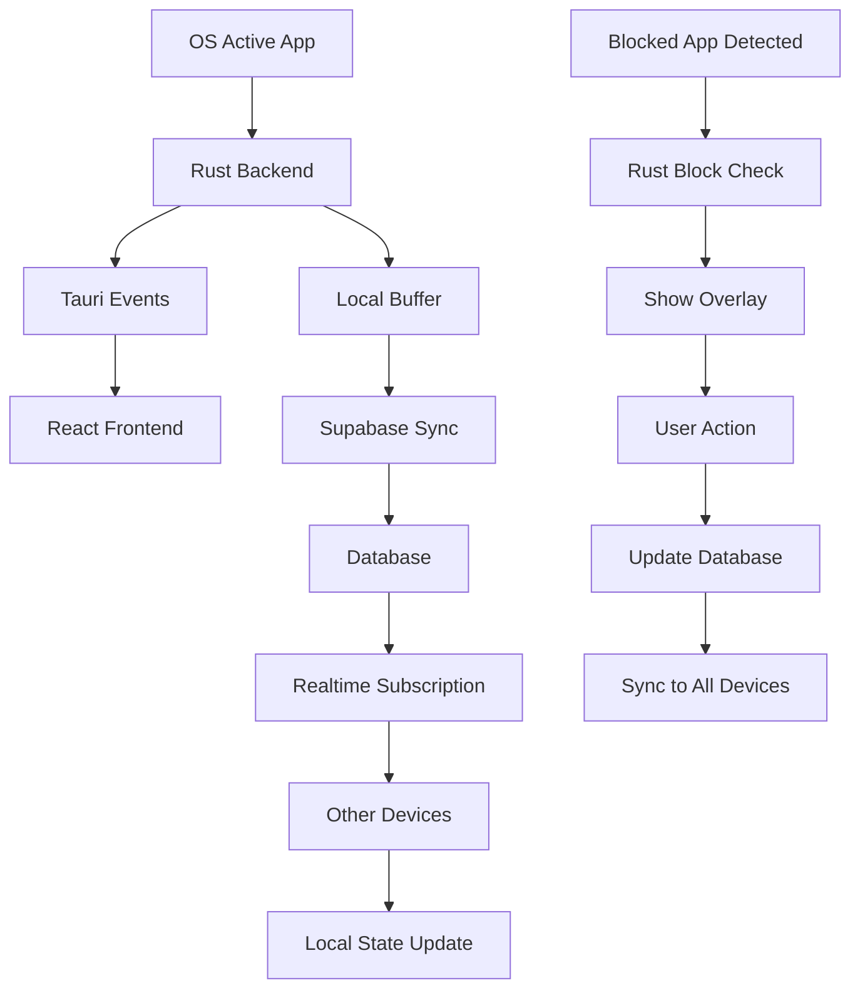

I'll analyze your codebase to understand the current architecture and then explain how the app usage tracking and blocking system will work with real-time sync.

Read file: docs/prd.md
Read file: docs/architecture.md
Read file: src-tauri/src/main.rs
Read file: src-tauri/src/lib.rs
Ran tool
Read file: src-tauri/src/usage.rs
Read file: src/lib/supabase.ts
Read file: src/app/page.tsx
Read file: package.json
Based on my analysis of your codebase and the provided documentation, here's a comprehensive explanation of how the **loopd** app usage tracking and blocking system will work with real-time sync:

## High-Level Architecture Overview

**loopd** is a cross-platform productivity app built with **Tauri (Rust backend)** + **Next.js (React frontend)** + **Supabase (cloud backend)** that tracks app usage, blocks distracting apps, and syncs data across devices in real-time.

## 1. App Usage Tracking System

### Backend Tracking (Rust/Tauri)
The Rust backend will continuously monitor active applications using OS-specific APIs:

- **Windows**: Uses `GetForegroundWindow()` and `GetWindowText()` to detect active windows
- **macOS**: Uses `NSWorkspace` to get the active application
- **Linux**: Uses X11 APIs to detect active windows

The tracking works by:
1. **Polling every 1-2 seconds** to check which app is currently active
2. **Buffering usage data locally** to minimize network calls
3. **Emitting real-time events** to the frontend via Tauri's event system
4. **Syncing to Supabase** periodically (every 30-60 seconds) to avoid excessive API calls

### Data Structure
```rust
// Local usage tracking
struct AppUsage {
    app_name: String,
    start_time: DateTime,
    duration_seconds: u64,
    user_id: String,
}
```

## 2. Real-Time Sync with Supabase

### Database Schema
```sql
-- App usage logs
app_usage_logs (
  id UUID PRIMARY KEY,
  user_id UUID REFERENCES auth.users(id),
  app_name TEXT NOT NULL,
  duration_seconds INTEGER NOT NULL,
  start_time TIMESTAMP WITH TIME ZONE,
  device_id TEXT, -- To identify which device
  created_at TIMESTAMP WITH TIME ZONE DEFAULT NOW()
)

-- Blocked apps per user
blocked_apps (
  id UUID PRIMARY KEY,
  user_id UUID REFERENCES auth.users(id),
  app_name TEXT NOT NULL,
  created_at TIMESTAMP WITH TIME ZONE DEFAULT NOW()
)

-- Emergency overrides
overrides (
  id UUID PRIMARY KEY,
  user_id UUID REFERENCES auth.users(id),
  app_name TEXT NOT NULL,
  expires_at TIMESTAMP WITH TIME ZONE,
  created_at TIMESTAMP WITH TIME ZONE DEFAULT NOW()
)
```

### Real-Time Sync Implementation
Using [Supabase Realtime](https://supabase.com/realtime), the system will:

1. **Subscribe to database changes** for each user's data
2. **Sync across devices** when usage data is updated
3. **Update blocked app lists** in real-time across all user devices
4. **Handle presence** to show which devices are currently active

```typescript
// Frontend real-time subscription
const subscription = supabase
  .channel('app-usage')
  .on('postgres_changes', 
    { event: '*', schema: 'public', table: 'app_usage_logs' },
    (payload) => {
      // Update local state with new usage data
      updateUsageData(payload.new);
    }
  )
  .subscribe();
```

## 3. App Blocking System

### Detection & Blocking Flow
1. **Rust backend continuously monitors** active applications
2. **Checks against blocked apps list** (synced from Supabase)
3. **Validates override status** (temporary permissions)
4. **Triggers blocking UI** when blocked app is detected

### Blocking Implementation
```rust
// In block.rs
#[tauri::command]
pub fn check_blocked_app(app_name: &str) -> bool {
    // Check if app is in blocked list
    // Check if override exists and is valid
    // Return true if should be blocked
}

#[tauri::command]
pub fn kill_process(app_name: &str) {
    // OS-specific process termination
    // Windows: taskkill /F /IM app_name
    // macOS: killall app_name
    // Linux: pkill app_name
}
```

### Blocking UI
When a blocked app is detected:
1. **Tauri spawns fullscreen overlay** or **React modal**
2. **Shows blocking interface** with options:
   - "Close App" (terminates the process)
   - "Emergency Override" (temporary access)
3. **Logs the action** to Supabase for analytics

## 4. Frontend Display & User Management

### Authentication Flow
Using [Supabase Auth](https://supabase.com/docs/guides/auth):

```typescript
// Login component
const { data: { user }, error } = await supabase.auth.signInWithPassword({
  email: 'user@example.com',
  password: 'password'
});

// Session management
const { data: { session } } = await supabase.auth.getSession();
```

### Real-Time Dashboard
The frontend will display:

1. **Live usage statistics** with real-time updates
2. **Current active app** with duration
3. **Daily/weekly usage charts** using aggregated data
4. **Blocked apps management** interface
5. **Override history** and analytics

### Cross-Device Sync
- **Usage data syncs automatically** across all user devices
- **Blocked apps list** updates in real-time
- **Override permissions** sync across devices
- **Presence indicators** show which devices are active

## 5. Data Flow Architecture



## 6. Security & Performance Considerations

### Security
- **Row Level Security (RLS)** on Supabase tables
- **User-specific data isolation**
- **Secure session management** with Supabase Auth
- **Local data encryption** for sensitive usage patterns

### Performance
- **Local buffering** to minimize API calls
- **Batch updates** to Supabase (every 30-60 seconds)
- **Efficient polling** (1-2 second intervals)
- **Real-time subscriptions** only for active users

### Cross-Platform Compatibility
- **Windows**: Native Win32 APIs for window detection
- **macOS**: Accessibility permissions for app monitoring
- **Linux**: X11 support with Wayland compatibility

This architecture ensures that users get real-time visibility into their app usage across all devices, with intelligent blocking that adapts to their productivity needs while maintaining data consistency and security.