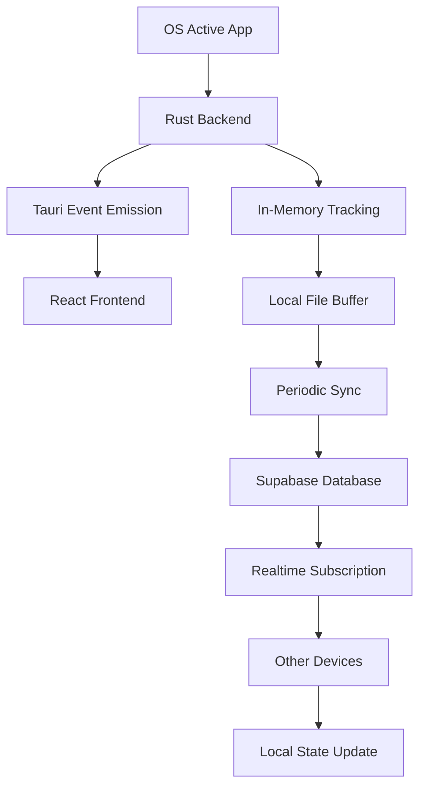

# 📄 Storage Architecture Document: loopd - Secure Data Management

## 1. **Overview**

This document outlines the storage architecture for **loopd**, a cross-platform productivity app that tracks app usage, blocks distracting applications, and syncs data across devices. The architecture implements a **hybrid storage approach** that prioritizes security, performance, and cross-device synchronization.

---

## 2. **Storage Strategy: Why Not Local Storage**

### 2.1 Security Concerns with Browser Local Storage

Based on security research and best practices, we've chosen to **avoid browser local storage** for the following reasons:

- **XSS Vulnerability**: Local storage is accessible to any JavaScript running on the page, making it vulnerable to cross-site scripting attacks
- **No Data Protection**: Any script can read/write local storage data without restrictions
- **Synchronous Operations**: Local storage operations block the main thread, impacting performance
- **Limited Storage**: 5MB limit across all major browsers
- **No Encryption**: Data is stored in plain text

**Reference**: [Please Stop Using Local Storage](https://dev.to/rdegges/please-stop-using-local-storage-1i04)

### 2.2 Recommended Alternative: Hybrid Approach

Our architecture uses a **three-tier storage system**:

1. **Rust Backend**: Secure local storage and real-time tracking
2. **Supabase**: Cloud storage and cross-device synchronization
3. **Tauri Commands**: Secure frontend-backend communication

---

## 3. **Storage Architecture Components**

### 3.1 Rust Backend Storage (Local Tier)

#### In-Memory Tracking
```rust
// Real-time usage tracking in memory
struct UsageTracker {
    current_session: HashMap<String, AppUsage>,
    blocked_apps: HashSet<String>,
    active_overrides: HashMap<String, DateTime<Utc>>,
    device_id: String,
}

struct AppUsage {
    app_name: String,
    start_time: DateTime<Utc>,
    duration_seconds: u64,
    user_id: String,
}
```

#### Persistent Local Storage
```rust
// File-based persistent storage
struct LocalStorage {
    usage_buffer: Vec<AppUsageLog>,
    settings: AppSettings,
    device_id: String,
    last_sync: Option<DateTime<Utc>>,
}

impl LocalStorage {
    fn save_to_file(&self) -> Result<(), Box<dyn std::error::Error>> {
        let data = serde_json::to_string(self)?;
        fs::write(self.get_storage_path(), data)?;
        Ok(())
    }
    
    fn load_from_file() -> Result<Self, Box<dyn std::error::Error>> {
        let path = Self::get_storage_path();
        if path.exists() {
            let data = fs::read_to_string(path)?;
            Ok(serde_json::from_str(&data)?)
        } else {
            Ok(Self::default())
        }
    }
}
```

### 3.2 Supabase Cloud Storage (Remote Tier)

#### Database Schema
```sql
-- App usage logs with device tracking
CREATE TABLE app_usage_logs (
    id UUID PRIMARY KEY DEFAULT gen_random_uuid(),
    user_id UUID REFERENCES auth.users(id) ON DELETE CASCADE,
    app_name TEXT NOT NULL,
    duration_seconds INTEGER NOT NULL,
    start_time TIMESTAMP WITH TIME ZONE NOT NULL,
    device_id TEXT NOT NULL,
    created_at TIMESTAMP WITH TIME ZONE DEFAULT NOW()
);

-- Blocked apps per user
CREATE TABLE blocked_apps (
    id UUID PRIMARY KEY DEFAULT gen_random_uuid(),
    user_id UUID REFERENCES auth.users(id) ON DELETE CASCADE,
    app_name TEXT NOT NULL,
    created_at TIMESTAMP WITH TIME ZONE DEFAULT NOW(),
    UNIQUE(user_id, app_name)
);

-- Emergency overrides with expiration
CREATE TABLE overrides (
    id UUID PRIMARY KEY DEFAULT gen_random_uuid(),
    user_id UUID REFERENCES auth.users(id) ON DELETE CASCADE,
    app_name TEXT NOT NULL,
    expires_at TIMESTAMP WITH TIME ZONE NOT NULL,
    created_at TIMESTAMP WITH TIME ZONE DEFAULT NOW()
);

-- Row Level Security (RLS) Policies
ALTER TABLE app_usage_logs ENABLE ROW LEVEL SECURITY;
ALTER TABLE blocked_apps ENABLE ROW LEVEL SECURITY;
ALTER TABLE overrides ENABLE ROW LEVEL SECURITY;

-- Users can only access their own data
CREATE POLICY "Users can view own usage logs" ON app_usage_logs
    FOR SELECT USING (auth.uid() = user_id);

CREATE POLICY "Users can insert own usage logs" ON app_usage_logs
    FOR INSERT WITH CHECK (auth.uid() = user_id);
```

### 3.3 Frontend Communication (Interface Tier)

#### Tauri Commands
```rust
// Secure communication between frontend and backend
#[tauri::command]
pub async fn get_local_usage_data() -> Result<LocalUsageBuffer, String> {
    LocalUsageBuffer::load_from_file()
        .map_err(|e| e.to_string())
}

#[tauri::command]
pub async fn sync_to_supabase(usage_data: Vec<AppUsageLog>) -> Result<(), String> {
    // Send to Supabase via HTTP client
    // Update local buffer
    Ok(())
}

#[tauri::command]
pub async fn get_blocked_apps() -> Result<Vec<String>, String> {
    // Return local blocked apps list
    Ok(vec![])
}
```

#### Frontend Implementation
```typescript
// Frontend uses Tauri commands instead of localStorage
import { invoke } from '@tauri-apps/api/tauri';

const getUsageData = async () => {
  try {
    const localData = await invoke('get_local_usage_data');
    return localData;
  } catch (error) {
    console.error('Failed to get local usage data:', error);
    return null;
  }
};

const syncData = async (usageData: AppUsageLog[]) => {
  try {
    await invoke('sync_to_supabase', { usageData });
  } catch (error) {
    console.error('Failed to sync data:', error);
  }
};
```

---

## 4. **Data Flow Architecture**

### 4.1 Real-Time Usage Tracking Flow



### 4.2 Sync Strategy

#### Buffered Sync Approach
- **Local Buffer**: Store usage data locally for 30-60 seconds
- **Batch Updates**: Send multiple usage logs in single API call
- **Offline Support**: Continue tracking when network is unavailable
- **Conflict Resolution**: Use timestamps to handle concurrent updates

#### Sync Frequency
```rust
// Sync every 30 seconds when app is active
const SYNC_INTERVAL: Duration = Duration::from_secs(30);

// Sync immediately on app focus/blur
const IMMEDIATE_SYNC_EVENTS: [&str; 2] = ["app_focus", "app_blur"];
```

---

## 5. **Security Implementation**

### 5.1 Data Protection

#### Local Storage Security
- **File System Permissions**: Use OS-level file permissions
- **Encryption**: Optional local encryption for sensitive data
- **Secure Paths**: Store data in app-specific directories
- **Access Control**: Only Rust backend can access local files

#### Network Security
- **HTTPS Only**: All Supabase communication over HTTPS
- **API Key Management**: Secure storage of Supabase credentials
- **Request Signing**: Sign requests to prevent tampering
- **Rate Limiting**: Implement client-side rate limiting

### 5.2 Authentication & Authorization

#### Supabase Auth Integration
```typescript
// Secure session management
import { createClient } from '@supabase/supabase-js';

const supabase = createClient(
  process.env.NEXT_PUBLIC_SUPABASE_URL!,
  process.env.NEXT_PUBLIC_SUPABASE_ANON_KEY!
);

// Row Level Security ensures users only access their data
const { data: { user } } = await supabase.auth.getUser();
```

#### Session Management
- **Secure Cookies**: Use HTTP-only, secure cookies for session tokens
- **Token Refresh**: Automatic token refresh before expiration
- **Session Cleanup**: Proper session cleanup on logout
- **Multi-Device Support**: Allow multiple active sessions per user

---

## 6. **Performance Considerations**

### 6.1 Optimization Strategies

#### Local Performance
- **In-Memory Tracking**: Real-time tracking in memory for speed
- **Lazy Loading**: Load historical data on demand
- **Efficient Polling**: 1-2 second intervals for active app detection
- **Background Processing**: Use Rust threads for heavy operations

#### Network Optimization
- **Batch Operations**: Group multiple operations into single requests
- **Compression**: Compress data before transmission
- **Caching**: Cache frequently accessed data
- **Connection Pooling**: Reuse HTTP connections

### 6.2 Resource Management

#### Memory Usage
- **Buffer Limits**: Limit local buffer size to prevent memory bloat
- **Garbage Collection**: Regular cleanup of old data
- **Memory Monitoring**: Track memory usage and optimize

#### Storage Usage
- **Data Retention**: Implement data retention policies
- **Compression**: Compress stored data
- **Cleanup Jobs**: Regular cleanup of old files

---

## 7. **Cross-Platform Compatibility**

### 7.1 Platform-Specific Storage Paths

#### Windows
```rust
// %APPDATA%/loopd/
let storage_path = dirs::data_dir()
    .unwrap()
    .join("loopd")
    .join("storage.json");
```

#### macOS
```rust
// ~/Library/Application Support/loopd/
let storage_path = dirs::data_dir()
    .unwrap()
    .join("loopd")
    .join("storage.json");
```

#### Linux
```rust
// ~/.local/share/loopd/
let storage_path = dirs::data_dir()
    .unwrap()
    .join("loopd")
    .join("storage.json");
```

### 7.2 Platform-Specific Considerations

#### Windows
- **Registry Integration**: Store settings in Windows Registry
- **UAC Compatibility**: Handle User Account Control restrictions
- **File Locking**: Handle file locking during sync operations

#### macOS
- **Sandbox Compliance**: Work within macOS app sandbox
- **Accessibility Permissions**: Handle accessibility permissions for app detection
- **App Store Guidelines**: Comply with App Store requirements

#### Linux
- **X11/Wayland Support**: Handle different display servers
- **Package Managers**: Support different package managers
- **Desktop Environments**: Adapt to different desktop environments

---

## 8. **Error Handling & Recovery**

### 8.1 Error Scenarios

#### Network Errors
- **Offline Mode**: Continue tracking when offline
- **Retry Logic**: Exponential backoff for failed requests
- **Queue Management**: Queue failed operations for retry
- **Graceful Degradation**: Reduce functionality when offline

#### Storage Errors
- **File Corruption**: Detect and recover from corrupted files
- **Disk Space**: Handle low disk space scenarios
- **Permission Errors**: Handle permission issues gracefully
- **Backup Strategy**: Maintain backup of critical data

### 8.2 Recovery Mechanisms

#### Data Recovery
```rust
impl LocalStorage {
    fn recover_from_backup(&self) -> Result<(), Box<dyn std::error::Error>> {
        let backup_path = self.get_backup_path();
        if backup_path.exists() {
            let data = fs::read_to_string(backup_path)?;
            let recovered: LocalStorage = serde_json::from_str(&data)?;
            self.save_to_file()?;
            Ok(())
        } else {
            Err("No backup available".into())
        }
    }
}
```

#### Sync Recovery
- **Conflict Resolution**: Handle data conflicts between devices
- **Partial Sync**: Resume sync from last successful point
- **Data Validation**: Validate data integrity before sync
- **Rollback Capability**: Rollback to previous state if needed

---

## 9. **Monitoring & Analytics**

### 9.1 Performance Monitoring

#### Metrics to Track
- **Sync Performance**: Time taken for data synchronization
- **Storage Usage**: Local and remote storage consumption
- **Error Rates**: Frequency of sync and storage errors
- **User Engagement**: App usage patterns and features used

#### Health Checks
```rust
#[tauri::command]
pub async fn health_check() -> Result<HealthStatus, String> {
    let local_storage = LocalStorage::load_from_file()?;
    let supabase_connection = test_supabase_connection().await?;
    
    Ok(HealthStatus {
        local_storage_healthy: local_storage.is_valid(),
        supabase_healthy: supabase_connection.is_ok(),
        last_sync: local_storage.last_sync,
        pending_sync_count: local_storage.usage_buffer.len(),
    })
}
```

### 9.2 Debugging & Logging

#### Logging Strategy
- **Structured Logging**: Use structured logging for better analysis
- **Log Levels**: Different log levels for different environments
- **Log Rotation**: Implement log rotation to manage storage
- **Remote Logging**: Send critical logs to remote service

---

## 10. **Future Enhancements**

### 10.1 Planned Improvements

#### Advanced Features
- **End-to-End Encryption**: Encrypt data before transmission
- **Differential Sync**: Only sync changed data
- **Predictive Caching**: Cache data based on usage patterns
- **Multi-User Support**: Support for shared devices

#### Performance Optimizations
- **Database Indexing**: Optimize database queries
- **Connection Pooling**: Improve connection management
- **Background Processing**: Move heavy operations to background
- **Memory Optimization**: Reduce memory footprint

### 10.2 Scalability Considerations

#### Horizontal Scaling
- **Load Balancing**: Distribute load across multiple servers
- **Database Sharding**: Shard data by user or region
- **CDN Integration**: Use CDN for static assets
- **Microservices**: Break down into smaller services

#### Vertical Scaling
- **Resource Optimization**: Optimize resource usage
- **Caching Layers**: Add multiple caching layers
- **Database Optimization**: Optimize database performance
- **Code Optimization**: Optimize critical code paths

---

## 11. **Conclusion**

This hybrid storage architecture provides **loopd** with:

- **Security**: Protection against XSS and unauthorized access
- **Performance**: Fast local operations with efficient cloud sync
- **Reliability**: Offline support and error recovery
- **Scalability**: Support for multiple devices and users
- **Maintainability**: Clear separation of concerns and modular design

By avoiding browser local storage and implementing a robust Rust-based local storage system with Supabase cloud synchronization, we ensure that user data remains secure, performant, and synchronized across all devices.

---

## 12. **References**

- [Please Stop Using Local Storage](https://dev.to/rdegges/please-stop-using-local-storage-1i04) - Security concerns with browser local storage
- [Supabase Realtime Documentation](https://supabase.com/realtime) - Real-time synchronization features
- [Tauri Security Best Practices](https://tauri.app/v1/api/js/) - Secure frontend-backend communication
- [Next.js Authentication Guide](https://nextjs.org/docs/14/app/building-your-application/authentication) - Session management best practices
- App names are now normalized and stored without file extensions for cross-platform consistency (e.g., 'chrome' instead of 'chrome.exe'). 